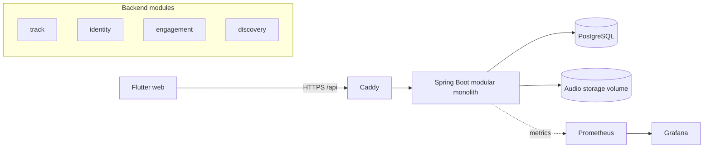

# Guide 07: Phase 7, bằng chứng và phát hành (tổng quan + checklist)

> Phase 7 · Cần xong trước: guide 01-06 chạy được (hoặc ít nhất Phase 1-4 + một phần Phase 5) · Mức độ: **hướng dẫn tổng quan**, ít khung code hơn guide 01-06.
> Kịch bản "v1.0 xong" (PROJECT_STATUS): *đăng ký → upload → track được xử lý → người khác follow, like, comment trên waveform → track hiện trong feed của họ → tìm được bằng search*, **chạy trên bản triển khai công khai**.

Phase này có bốn việc: **đo** (k6), **nhìn thấy** (Actuator/Micrometer/Grafana), **đưa lên mạng** (Docker Compose trên VPS), **kể lại** (README). Làm theo thứ tự đó: đo trước thì mới biết cần quan sát gì.

## 1. Mục tiêu và nghiệm thu

- [ ] Có bảng số liệu k6 (RPS, p50/p95/p99, tỉ lệ lỗi) cho ít nhất 5 kịch bản, ghi kèm cấu hình máy.
- [ ] Có dashboard Grafana với: tốc độ request, độ trễ p95 theo route, tỉ lệ lỗi, bộ nhớ JVM, kết nối DB đang dùng, độ dài hàng đợi xử lý audio.
- [ ] `docker compose up -d` trên VPS chạy toàn bộ (Postgres, backend, web, reverse proxy) và truy cập được qua HTTPS.
- [ ] Kịch bản "v1.0 xong" đi hết bằng tay trên bản công khai.
- [ ] README có sơ đồ kiến trúc, liên kết demo, hướng dẫn chạy, và bảng số liệu.
- [ ] `docs/phase-5-engagement.md`, `phase-6-discovery.md`, `phase-7-proof.md` được viết đúng quy ước (mục tiêu, quyết định + lý do, bẫy gặp phải). Không tạo file tài liệu theo từng task.

## 2. Đo tải với k6

### 2.1 Cần đo gì và vì sao
Mục tiêu không phải số "to" mà là **số thật có bối cảnh** để quyết định Phase 8 (Redis, MinIO...): cái gì chậm trước, và nó chậm vì đâu.

| Kịch bản | Điều học được | Ghi chú |
|----------|---------------|---------|
| A. `GET /tracks` + duyệt keyset 5 trang | chi phí truy vấn danh sách, N+1? | đã có `limit+1`, duration một truy vấn/trang |
| B. `GET /tracks/{id}/stream` với `Range: bytes=0-` | băng thông, `206`, giữ kết nối streaming | đo MB/s và số kết nối đồng thời tối đa |
| C. Hỗn hợp like/unlike trên **một** track nóng, và trên 1000 track | độ tắc nghẽn của dòng `tracks` (trace 3 guide 02) | so hai trường hợp |
| D. `GET /feed` của user follow 50 người, kho 100 000 track | hiệu quả index (guide 05) | dữ liệu seed bằng SQL ở guide 05 bước 6 |
| E. `GET /search?q=…` với 100 000 track | GIN trigram (guide 06) | cả truy vấn trúng và trượt |
| F. (tuỳ chọn) upload 5 MB đồng thời 5 người | hàng đợi xử lý + CPU ffmpeg | cẩn thận: nặng CPU |

### 2.2 Khung script
```javascript
// loadtest/browse.js  — chạy: k6 run -e BASE=http://localhost:8080 loadtest/browse.js
import http from 'k6/http';
import { check, sleep } from 'k6';

export const options = {
  scenarios: {
    browse: {
      executor: 'ramping-vus',
      stages: [
        { duration: '30s', target: 20 },   // khởi động
        { duration: '2m',  target: 20 },   // đo ổn định
        { duration: '30s', target: 0 },
      ],
    },
  },
  thresholds: {
    http_req_failed: ['rate<0.01'],
    http_req_duration: ['p(95)<300'],      // TODO: đặt ngưỡng theo số đo thật của bạn
  },
};

// setup() chạy MỘT lần: đăng nhập bằng BCrypt tốn CPU, đừng đăng nhập mỗi vòng lặp.
export function setup() {
  // TODO: POST /api/v1/auth/login cho N user thử nghiệm; trả về mảng accessToken
  return { tokens: [] };
}

export default function (data) {
  // TODO: duyệt 5 trang bằng nextCursor; check(res, { 'status 200': r => r.status === 200 })
  sleep(1);
}
```
Điểm cần nhớ:
- **Token sống 15 phút**: bài đo dài hơn thì phải refresh; hoặc tăng `lasono.jwt.access-token-ttl` **chỉ cho môi trường đo**.
- **Đừng đo qua `localhost` của WSL từ Windows** (xem README về `wslrelay`): chạy k6 và backend cùng trong WSL, hoặc k6 trên một máy khác.
- **Khởi động ấm (warm-up)**: JVM và cache của PostgreSQL cần thời gian; bỏ 30 giây đầu khi tính số liệu.
- Với `Range`: `http.get(url, { headers: { Range: 'bytes=0-' } })` và kiểm tra `status === 206`.
- Đo **một biến mỗi lần**: đổi một thứ (thêm index, đổi pool size) rồi chạy lại cùng kịch bản.

### 2.3 Ghi số liệu
Ghi vào `docs/phase-7-proof.md` (một file cho cả phase) theo mẫu:

| Kịch bản | VUs | RPS | p50 | p95 | p99 | Lỗi | CPU backend | CPU DB | Ghi chú |
|----------|-----|-----|-----|-----|-----|-----|-------------|--------|---------|
| A browse | 20 | … | … | … | … | … | … | … | trước/sau |

Luôn kèm: CPU/RAM máy, phiên bản (commit), kích thước dữ liệu, `hikari.maximum-pool-size`.

## 3. Quan sát: Actuator, Micrometer, Prometheus, Grafana

### 3.1 Thêm phụ thuộc và cấu hình
`build.gradle`:
```groovy
implementation 'org.springframework.boot:spring-boot-starter-actuator'
runtimeOnly 'io.micrometer:micrometer-registry-prometheus'
```
`application.yaml`:
```yaml
management:
  server:
    port: 8081                  # cổng riêng: KHÔNG publish ra ngoài trong docker compose
  endpoints:
    web:
      exposure:
        include: health,prometheus
  endpoint:
    health:
      probes:
        enabled: true
  metrics:
    distribution:
      percentiles-histogram:
        http.server.requests: true      # cần để tính p95 trong Prometheus/Grafana
```
**Bảo mật:** `SecurityConfig` hiện đóng mọi route không liệt kê (`anyRequest().authenticated()`), nên Prometheus sẽ nhận `401`. Mở **đúng hai đường dẫn** `/actuator/health/**` và `/actuator/prometheus` trong chuỗi bộ lọc,
và dựa vào việc cổng 8081 chỉ nằm trong mạng nội bộ Docker (không có `ports:` trong compose cho cổng đó). Viết `SecurityConfigTest` để chắc các endpoint khác của actuator vẫn đóng.
(Lưu ý: ở Spring Boot 4 các lớp trợ giúp `EndpointRequest` đã đổi package; dùng `requestMatchers("/actuator/…")` bằng chuỗi cho đơn giản.)

### 3.2 Số đo riêng của LaSono
Thêm 3 số đo có ý nghĩa nghiệp vụ (đây là phần "Micrometer" đáng học, ngoài số đo mặc định):

| Số đo | Loại | Ở đâu | Gợi ý |
|-------|------|-------|-------|
| `lasono.engagement.likes` (tag `action=added|removed`) | Counter | listener hoặc use case like | tăng khi `added == true` |
| `lasono.processing.queue.depth` | Gauge | `ProcessingJobQueue` | `SELECT count(*) FROM processing_jobs WHERE status IN ('PENDING','RUNNING')` mỗi lần Prometheus hỏi (rẻ nhờ index một phần) |
| `lasono.processing.duration` | Timer | `ProcessTrackUseCase` | bao quanh phần ffmpeg |

Giữ module `application` không phụ thuộc Micrometer trực tiếp nếu muốn thuần: tạo port `Metrics` (ví dụ `void likeAdded()`) và adapter dùng `MeterRegistry`. Hoặc chấp nhận `MeterRegistry` ở tầng infrastructure (listener), vì sự kiện đã tồn tại sẵn.

### 3.3 Prometheus + Grafana bằng Compose
```yaml
# docker-compose.observability.yml (chạy kèm file compose chính)
services:
  prometheus:
    image: prom/prometheus:latest        # TODO: ghim phiên bản
    volumes: [ "./ops/prometheus.yml:/etc/prometheus/prometheus.yml:ro" ]
  grafana:
    image: grafana/grafana:latest        # TODO: ghim phiên bản
    ports: [ "127.0.0.1:3001:3000" ]     # chỉ truy cập qua SSH tunnel hoặc proxy có mật khẩu
    volumes: [ "grafana-data:/var/lib/grafana" ]
volumes: { grafana-data: {} }
```
```yaml
# ops/prometheus.yml
scrape_configs:
  - job_name: lasono-backend
    metrics_path: /actuator/prometheus
    scrape_interval: 15s
    static_configs: [ { targets: [ "backend:8081" ] } ]
```
Bảng điều khiển tối thiểu (mỗi ô một truy vấn PromQL; tự viết, đây là bài tập):
tốc độ request `rate(http_server_requests_seconds_count[1m])`; p95 theo route `histogram_quantile(0.95, sum by (le, uri) (rate(http_server_requests_seconds_bucket[5m])))`;
lỗi `5xx`; `jvm_memory_used_bytes`; `hikaricp_connections_active`; `lasono_processing_queue_depth`.
Lưu JSON dashboard vào `ops/grafana/` để chạy lại được (provisioning).

## 4. Đưa lên VPS bằng Docker Compose

### 4.1 Kiến trúc triển khai (khuyến nghị một origin)
```
Internet ──443──► Caddy (TLS tự động)
                    ├── /api/*  ──► backend:8080   (Spring Boot, có ffmpeg)
                    └── /*      ──► static (Flutter web build)
backend ──► postgres:5432   (mạng nội bộ, KHÔNG publish cổng)
backend:8081 ──► prometheus (mạng nội bộ)
volumes: pgdata, audio-storage, caddy-data, grafana-data
```
**Một origin (cùng domain cho web và API)** bỏ hẳn CORS, và cookie refresh `SameSite=Strict; Secure` hoạt động đúng (HTTPS bắt buộc: ghi trong README WSL rằng `Secure` không chạy trên `http://<IP>`).
App web build với `--dart-define=API_BASE_URL=https://lasono.example.com` (app tự nối `/api/v1/...`).

### 4.2 Các tệp cần có
| Tệp | Nội dung / điểm cần nhớ |
|-----|-------------------------|
| `backend/Dockerfile` | Nhiều giai đoạn: `gradle build -x test` ở image JDK 21 → chạy ở image JRE 21 + `apt-get install -y ffmpeg` (worker cần `ffmpeg` và `ffprobe`). Chạy bằng user không phải root. |
| `app/Dockerfile` hoặc bước build | `flutter build web --release --dart-define=API_BASE_URL=…`; sao chép `build/web` vào image Caddy hoặc volume. |
| `docker-compose.prod.yml` | `postgres` (volume `pgdata`, không `ports:`), `backend` (phụ thuộc `postgres` healthy), `caddy`. `restart: unless-stopped`. `healthcheck` cho backend dùng `/actuator/health` qua cổng 8081. |
| `Caddyfile` | `lasono.example.com { handle /api/* { reverse_proxy backend:8080 } handle { root * /srv/web; try_files {path} /index.html; file_server } }`. Đặt giới hạn thân request ≥ 52 MB cho upload nếu dùng proxy khác (nginx: `client_max_body_size 52m;`). |
| `.env` (KHÔNG commit) | `LASONO_JWT_SECRET` (≥ 32 byte: `openssl rand -base64 48`), `POSTGRES_PASSWORD`. Có `.env.example` thay thế để commit. |

Cấu hình backend qua biến môi trường (quy tắc Spring: `lasono.storage.root` → `LASONO_STORAGE_ROOT`):
`SPRING_DATASOURCE_URL=jdbc:postgresql://postgres:5432/lasono`, `SPRING_DATASOURCE_USERNAME`, `SPRING_DATASOURCE_PASSWORD`, `LASONO_STORAGE_ROOT=/data/audio` (mount volume), `LASONO_JWT_SECRET`.
Với một origin không cần `LASONO_CORS_ALLOWED_ORIGINS`; nếu tách domain thì đặt nó đúng origin của web.

### 4.3 Việc phải làm trên VPS
1. Tường lửa: chỉ mở 22, 80, 443. Postgres, 8080, 8081, Prometheus **không** ra ngoài.
2. Trỏ DNS, `docker compose -f docker-compose.prod.yml up -d --build`, theo dõi `docker compose logs -f backend` (Flyway chạy migration lần đầu).
3. Sao lưu: `pg_dump` hằng ngày bằng cron + sao chép volume `audio-storage` (hai thứ này **phải** khớp nhau; nêu rõ trong README).
4. Quy trình cập nhật: `git pull && docker compose up -d --build`; migration chạy khi backend khởi động (kiểm tra checksum: **không** sửa migration đã phát hành).
5. Kiểm tra kịch bản "v1.0 xong" bằng tay, bằng hai tài khoản trên hai trình duyệt.

### 4.4 Những thứ hay hỏng
| Lỗi | Nguyên nhân |
|-----|-------------|
| Đăng nhập được nhưng reload mất phiên | Cookie `Secure` trên HTTP; hoặc proxy xoá `Set-Cookie`; kiểm tra `SameSite` và `Path=/api/v1/auth` có còn đúng sau proxy |
| Upload `413` | Giới hạn thân request ở proxy (không phải ở Spring) |
| Stream không tua được | Proxy chuyển `Range` sai hoặc nén phản hồi âm thanh; kiểm tra `Accept-Ranges`, `Content-Range` |
| Track mãi `PROCESSING` | Image backend thiếu `ffmpeg`; hoặc `worker-enabled=false` |
| `permission denied` ghi vào `/data/audio` | User không phải root không sở hữu volume |
| Mất file âm thanh sau khi tạo lại container | Quên mount volume cho `LASONO_STORAGE_ROOT` |

## 5. README và tài liệu

README (gốc repo) cần có, theo thứ tự: một câu giới thiệu + ảnh/GIF màn hình chính · **liên kết demo** · sơ đồ kiến trúc (Mermaid hiển thị được trên GitHub) ·
tính năng (khớp "v1.0 xong") · cách chạy cục bộ (đã có, giữ) · bảng số liệu k6 và ảnh dashboard · quyết định kiến trúc quan trọng (link `docs/adr/`, phase docs) · hạn chế đã biết.


(Sơ đồ chỉ là khởi đầu: vẽ lại đúng module và hướng phụ thuộc của bạn.)

Tài liệu cuối phase (theo `CLAUDE.md`): `docs/phase-5-engagement.md`, `docs/phase-6-discovery.md`, `docs/phase-7-proof.md`:
mục tiêu, quyết định thiết kế **và lý do**, bẫy đã gặp. `docs/adr/` chỉ khi có quyết định kiến trúc lớn (ví dụ "module `discovery` được phép đọc bảng của module khác", "sự kiện đồng bộ trong cùng transaction") và **hỏi trước**.
`docs/learning-log.md`: chỉ khái niệm mới/bug khó (deadlock follow, lost update, bộ đếm bị `save` ghi đè là ứng viên tốt).

## 6. Checklist Phase 7

**Đo**
- [ ] Dữ liệu seed lớn trong database tạm (100 000 track), có `ANALYZE`
- [ ] 5 script k6 trong `loadtest/`, mỗi script có ngưỡng (`thresholds`)
- [ ] Bảng số liệu trong `docs/phase-7-proof.md` kèm cấu hình máy và commit
- [ ] Ít nhất một cải tiến có số "trước/sau" (ví dụ thêm index ở guide 05)

**Quan sát**
- [ ] Actuator trên cổng riêng, chỉ `health` và `prometheus` mở
- [ ] Test bảo mật chứng minh endpoint actuator khác đóng
- [ ] 3 số đo riêng (likes, queue depth, processing duration)
- [ ] Dashboard Grafana lưu thành JSON trong repo

**Triển khai**
- [ ] Dockerfile backend có ffmpeg, chạy non-root
- [ ] Compose prod: Postgres không publish cổng, volume cho DB và audio
- [ ] HTTPS hoạt động, cookie refresh giữ phiên sau reload
- [ ] Upload 50 MB qua proxy được; tua bài (Range `206`) qua proxy được
- [ ] Sao lưu `pg_dump` + audio, có hướng dẫn khôi phục
- [ ] Kịch bản "v1.0 xong" chạy hết trên bản công khai (hai tài khoản)

**Tài liệu**
- [ ] README đủ các mục ở phần 5
- [ ] Phase docs 5, 6, 7 viết xong; `PROJECT_STATUS.md` tick đầy đủ

## 7. Câu hỏi tự kiểm tra

<details><summary>Hiện đáp án gợi ý sau khi tự trả lời</summary>

1. **Vì sao `login` phải nằm trong `setup()` của k6?** BCrypt tốn CPU có chủ ý; đăng nhập mỗi vòng sẽ đo BCrypt chứ không đo API bạn muốn.
2. **p95 là gì và vì sao quan trọng hơn trung bình?** 95% request nhanh hơn giá trị đó; trung bình giấu đuôi chậm mà người dùng cảm nhận.
3. **Vì sao actuator nên nằm cổng riêng?** Không publish cổng đó ra ngoài thì không cần phụ thuộc hoàn toàn vào cấu hình bảo mật để chặn.
4. **Một origin giúp được gì so với hai domain?** Bỏ CORS, cookie `SameSite=Strict` đơn giản, ít cấu hình.
5. **Vì sao backup DB phải đi kèm backup thư mục âm thanh?** DB chỉ giữ metadata và khoá lưu trữ; thiếu một trong hai là bản ghi trỏ vào hư vô.
6. **Vì sao ghi lại cấu hình máy cùng số đo?** Số liệu không có bối cảnh không so sánh được.

</details>

## 8. Bài tập mở rộng

1. **Dashboard có cảnh báo:** một rule Prometheus cảnh báo khi p95 > ngưỡng 5 phút liên tục hoặc `queue depth` > 50.
2. **Tự động hoá phát hành:** workflow GitHub Actions build image, đẩy lên registry, và trên VPS `docker compose pull && up -d`. Thêm bước chạy lại một script k6 ngắn làm "smoke test" sau khi triển khai.
